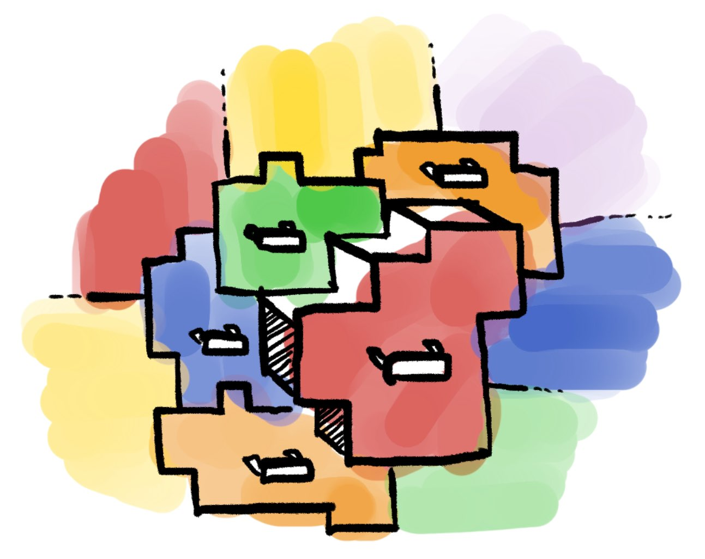

## 5. Raid The Cabinets

Now that you're in it's time to get the brain cells. You see a colorful wall full of what looks like square cabinets,
each holding
a single brain cell for testing. Upon closer inspection, you realize that you're actually looking at a few large
cabinets,
each one color, consisting of adjacent cells of the same color! You only have time to open one cabinet, so please choose
the biggest one and return the area of the cabinet, which is the number of square cells that make up the cabinet.
Cells are adjacent if they're touching on the top, bottom, left, or right, but **not** if they are only touching
diagonally.



### The task

Write a function `largest_color(colors: list[list[int]]) -> int` that takes in a 2d array of integers, with each
different
integer representing a different color, and each individual number representing the color of the cabinet at that cell.
Return an integer, the size of the largest group of adjacent cells that are the same color.

_You can earn partial credit (at least 40%) if you correctly solve this problem for the case where there's
only one adjacent group of each color (e.g. like sample input 1). Note that you may submit multiple times._

### Sample Input 1

```python
largest_color(
    [[1, 1, 2, 2, 2],
     [3, 1, 1, 1, 2],
     [3, 3, 1, 4, 4]
     ])
```

### Sample Output

```python
6
``` 

Suppose `1` represents red, `2` represents blue, `3` represents yellow, and `4` represents green.
Then the red (`1`) cabinet is made up of 6 adjacent cells, the blue cabinet is made up of 4 cells, the yellow cabnet
is made up of 3 cells, and the green cabinet is only one cell big. Since the biggest cabinet has `6` cells, that's our anwer.

**Sample Input 2**

```python
largest_color(
    [[1, 1, 2, 2, 2],
     [3, 1, 1, 1, 2],
     [3, 3, 1, 4, 2]
     [3, 3, 4, 4, 2],
     [1, 1, 1, 2, 2]
     ])
```

**Sample Output**

```python
7
``` 

The `2` cabinets are made up of 7 adjacent cells. Although the `1` cabinets are bigger, they're not connected, so
it consists of one cabinet of size `6` and one cabinet of size `3`.
